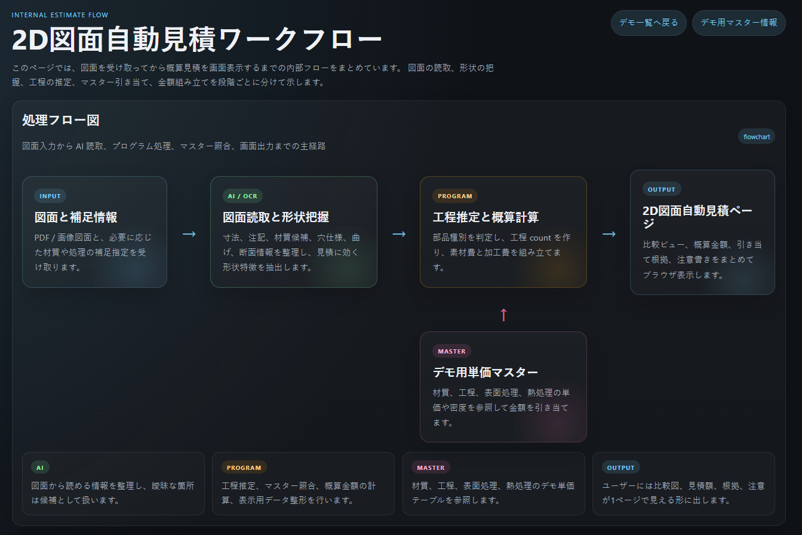
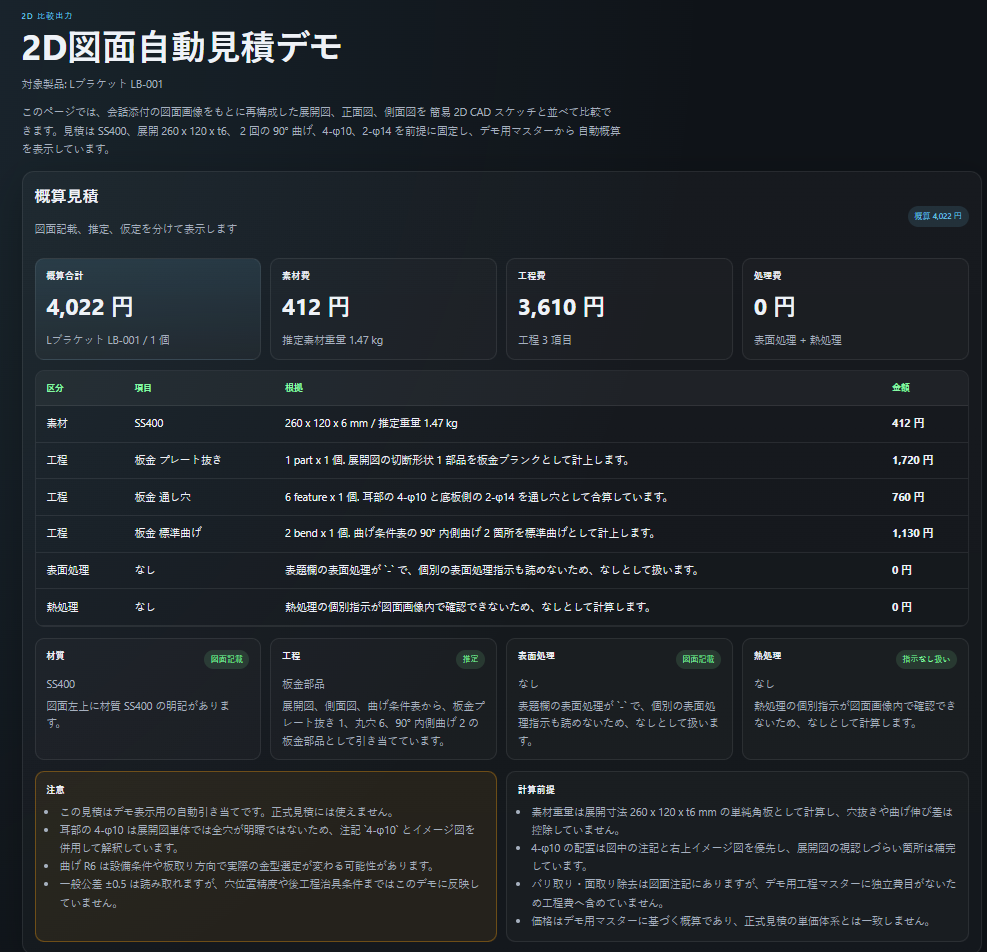
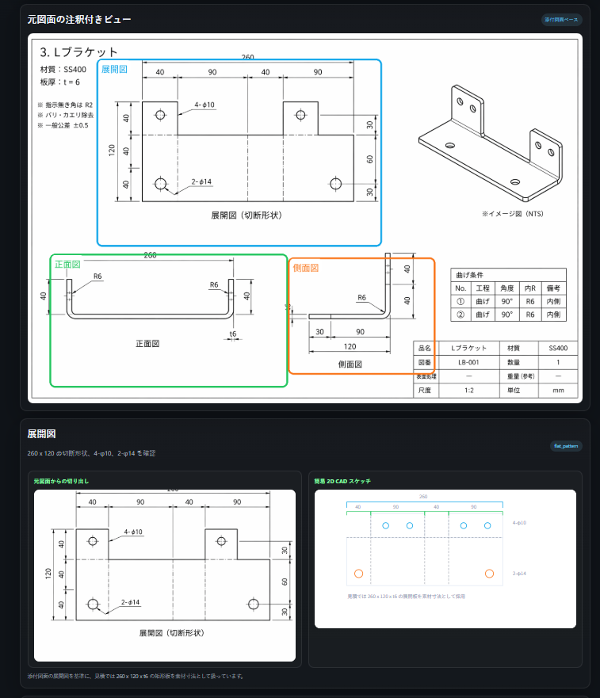

# CraftMind

このリポジトリは、図面や CAD データから工程と概算見積を整理し、比較ビュー付きのデモとして出力するための作業台です。
現行の主系は `2D図面比較 + 自動概算見積` のデモ生成です。

## 目的

入力図面や CAD データから次を作ります。

1. 図面読取結果
2. 工程ルート案
3. 材質 / 工程 / 表面処理 / 熱処理の引き当て
4. 概算金額
5. 比較ビュー付きの HTML デモ
6. 必要に応じた工程メモや検証メモ

## AI エージェントの役割

このシステムでは、AI エージェントが処理のオーケストレーションを担います。

- 図面画像を入力した場合
  - OCR 的に寸法、穴、材質、注記を拾う
- CAD を入力した場合
  - DXF / STEP を解析して外形、穴候補、概略寸法を拾う
- その後
  - 工程候補を整理する
  - マスターを参照して見積条件を引き当てる
  - 比較ビューと概算見積ページを生成する

つまり、Codex や Claude Code のような AI エージェントを中核にして、
OCR、形状解析、見積前提整理、HTML 生成をリポジトリ内で反復可能に回すための構成です。

## 処理フロー

図面入力から見積表示までの全体像です。



## CAD 入力の扱い

PDF / 画像だけでなく、`DXF` と `STEP` の入力も扱えます。
ただし、現時点の正式運用では CAD からの 3D プレビュー生成は対象外です。

- `DXF`
  - 2D 形状要素の抽出対象
  - 外形、線分、円、穴候補、概略寸法を拾う
- `STEP`
  - 3D 形状要素の抽出対象
  - bbox、面数、円筒面、穴候補、概略寸法を拾う
- `STEP` の実メッシュ表示や Web 向け 3D viewer は行わない
- `STEP` は抽出メトリクス、簡易投影、feature 要約までに留める

## 画面イメージ

### 詳細画面 1



### 詳細画面 2



## 出力規約

- 作業用成果物: `src/workflow/`
- 可視化資産: `src/viewer/`
- 生成スクリプト: `src/compare/`
- 見積マスター: `src/master/demo/`
- 公開差し替え用サンプル: `src/sample_data/`

## 主な構成

- `src/viewer/`
  - デモ一覧、個別 HTML、共通 CSS / JS
- `src/compare/`
  - 比較ビューや見積デモの生成スクリプト
- `src/cad/`
  - DXF / STEP の簡易解析コード
- `src/master/demo/`
  - 材質 / 工程 / 表面処理 / 熱処理マスター
- `src/sample_data/`
  - AI 生成の公開向けサンプル図面 / DXF / STEP
- `src/workflow/`
  - テンプレートと補助文書

## デモ一覧

- [デモ一覧](./src/viewer/index.html)
- [ベースプレート 300 x 200](./src/viewer/demos/public_sample_plate_grid_300x200_v1_drawing_only.html)
- [Lブラケット LB-001](./src/viewer/demos/lb001_l_bracket_2d.html)
- [サンプルガイドブロック B](./src/viewer/demos/cad_input_dxf_guide_block_b.html)
- [見積ワークフロー](./src/viewer/workflow_demo.html)
- [デモ用マスター情報](./src/viewer/master_demo.html)

## 起動方法

```powershell
cd src/viewer
python -m http.server 8000
```

開く URL:

```text
http://localhost:8000/
http://localhost:8000/workflow_demo.html
http://localhost:8000/master_demo.html
http://localhost:8000/demos/public_sample_plate_grid_300x200_v1_drawing_only.html
http://localhost:8000/demos/cad_input_dxf_guide_block_b.html
http://localhost:8000/demos/lb001_l_bracket_2d.html
```

## サンプルデータについて

`src/sample_data/` 配下のサンプルデータは、AI を使って生成した公開向け評価用サンプルです。
システム評価、デモ確認、画面比較、見積ロジック検証の用途を想定しています。
実在製品の整合性、加工成立性、寸法妥当性、量産適合性は保証しません。
